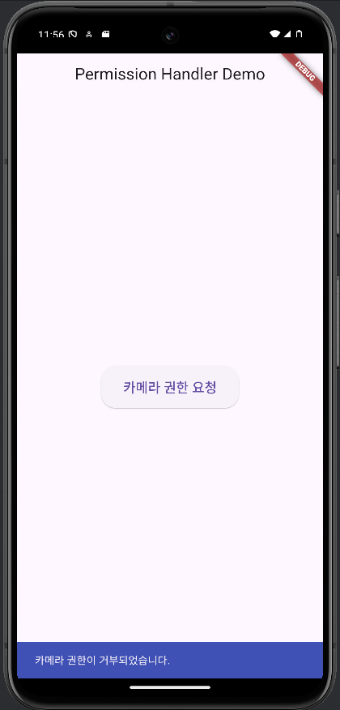
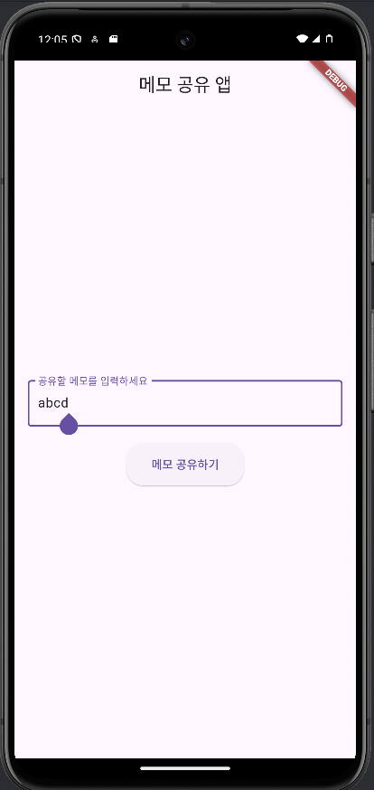
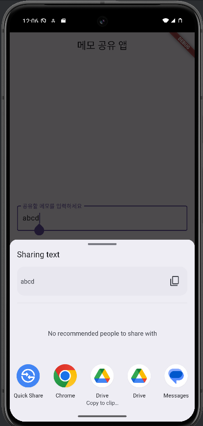

# permission_handler
* permission_handler plugin은 Flutter에서 다양한 권한(카메라, 위치, 연락처 등)을 요청하고 확인할 수 있도록 도와준다.

* 사용자가 권한을 거부할 수 있으며, 앱 설정을 열어 권한을 직접 수정할 수 있는 기능도 제공한다.

# share_plus
* Flutter 앱에서 텍스트, 이미지, 파일 등을 플랫폼의 기본 공유 인터페이스를 통해 공유할 수 있게 해주는 패키지이다.

* 앱에서 사용자가 텍스트, 링크, 이미지 등을 다른 사람들과 손쉽게 공유해야 할 때 유용하다.

  
  

